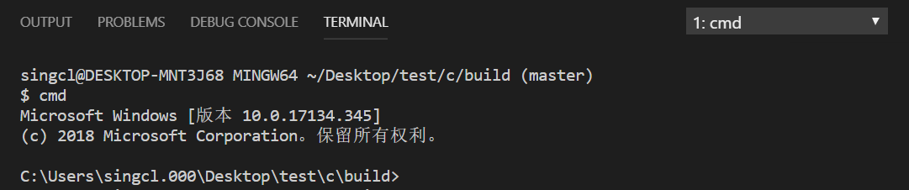

vscode 配置 C/C++智能提示的三种方法：https://github.com/Microsoft/vscode-cpptools/blob/master/Documentation/Getting%20started%20with%20IntelliSense%20configuration.md

### windows C/C++ CMake make

#### 1. 当前 shell 切换到 cmd

比如从 git-bash, sh, cmder 等切换到 cmd

当然你也可以直接打开 cmd， cd 到当前目录

#### 2. 确定生成什么类型的 Makefile

MinGW 和 CMake 完全是无关的两个工具，所以，只需要安装后，把工具的路径加入到系统的 Path，就可以直接在 cmd.exe 中来使用。

因为 windows 版的 CMake 支持很多的编译器，而且其默认的一般是最新的 Visual Studio 20xx 工具,
相当于：`cmake -G "Visual Studio 15 2017" ../`. 这种不会生成 Makefile 文件，所有构建时使用`cmake --build ./`而不是`make`命令。

所以，需要指定 Makefile 的格式.以 MinGW 为例`cmake -G "MinGW Makefiles" ./`

输入`cmake -G`查看参数更多详情；输入`cmake --build`查看 build 更多详情

### 3.make

MinGW 中 make 为 mingw32-make

### #define VS const

